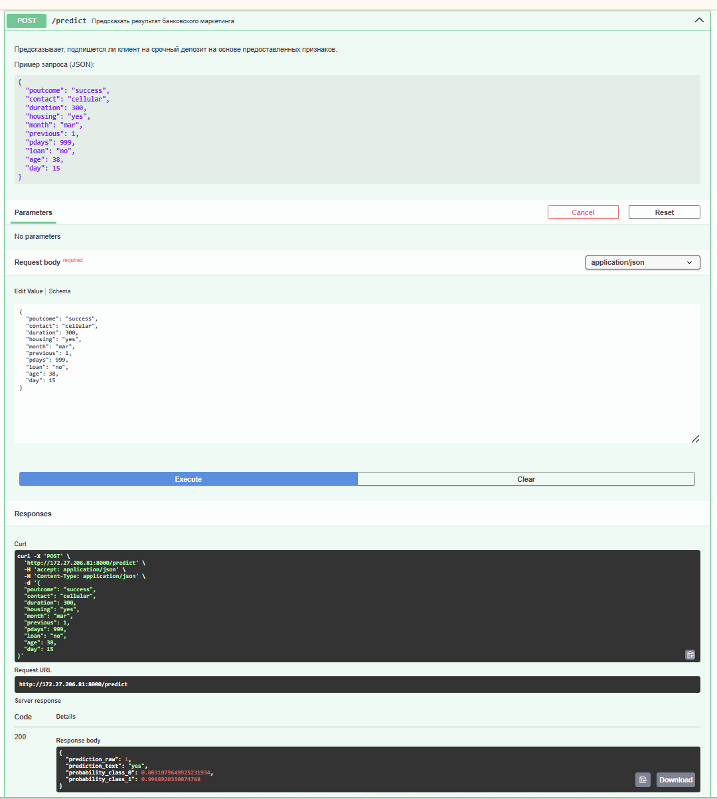
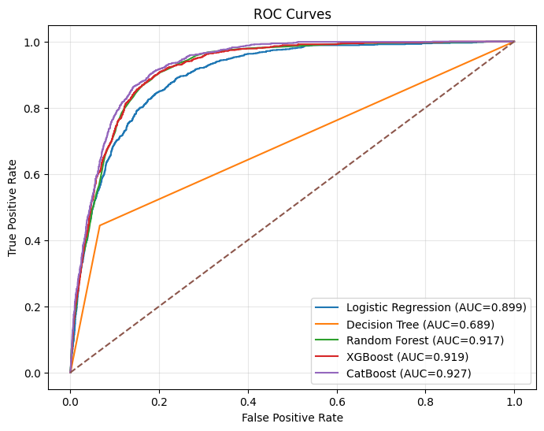
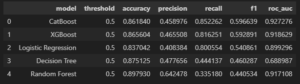
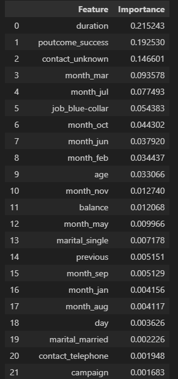

# Bank Marketing Campaign Prediction API

Проект для предсказания успеха банковской маркетинговой кампании с использованием машинного обучения и REST API.

## 📋 Описание

Этот проект реализует систему машинного обучения на базе XGBoost для предсказания вероятности успеха банковской маркетинговой кампании. Модель интегрирована с FastAPI для предоставления REST API с возможностью получения предсказаний в режиме реального времени.

## 🚀 Особенности

- **Машинное обучение**: Обученная модель XGBoost с высокой точностью предсказаний
- **REST API**: FastAPI для простого и быстрого доступа к предсказаниям
- **10 ключевых признаков**: Модель использует 10 наиболее информативных признаков
- **Предварительная обработка данных**: Автоматическая кодировка категориальных признаков
- **Документация**: Интерактивная документация Swagger UI встроена в API

## 📁 Структура проекта

```
Bank-Marketing-Campaign/
├── app/
│   ├── main.py              # FastAPI приложение
│   ├── endpoint.py          # Определение моделей данных Pydantic
│   ├── model.py             # Логика работы с моделью
│   ├── models/
│   │   ├── all_bank_marketing_artifacts.joblib  # Сохраненные артефакты модели
│   │   ├── xgboost_params.json
│   │   └── xgboost_params.txt
│   └── __pycache__/
├── data/
│   └── bank_full.csv        # Тренировочные данные
├── HW1.ipynb                # Jupyter notebook с анализом и обучением модели
├── README.md                # Этот файл
├── requirements.txt         # Зависимости проекта
```

## 🛠️ Установка

### 1. Клонирование репозитория

```bash
git clone <repository-url>
cd Bank-Marketing-Campaign
```

### 2. Создание виртуального окружения

```bash
# Windows
python -m venv venv
venv\Scripts\Activate.ps1

# Linux/macOS
python3 -m venv venv
source venv/bin/activate
```

### 3. Установка зависимостей

```bash
pip install -r requirements.txt
```

## 📦 Зависимости

- **numpy** - Численные вычисления
- **pandas** - Обработка данных
- **scikit-learn** - Инструменты машинного обучения
- **xgboost** - Градиентный бустинг
- **fastapi** - Веб-фреймворк
- **uvicorn** - ASGI сервер
- **pydantic** - Валидация данных
- **joblib** - Сохранение моделей
- **matplotlib**, **seaborn** - Визуализация данных

## 🚀 Запуск

### Запуск API сервера

```bash
python app/main.py
```

или напрямую через uvicorn:

```bash
uvicorn app.main:app --reload
```

Сервер запустится на `http://localhost:8000`

### Доступ к документации

- **Swagger UI**: http://localhost:8000/docs
- **ReDoc**: http://localhost:8000/redoc

## 📊 Используемые признаки

Модель использует следующие 10 ключевых признаков для предсказания:

| Признак | Тип | Описание |
|---------|-----|---------|
| `poutcome` | str | Результат предыдущей кампании |
| `contact` | str | Тип контакта |
| `duration` | int | Продолжительность контакта (сек) |
| `housing` | str | Есть ли ипотека |
| `month` | str | Месяц контакта |
| `previous` | int | Количество предыдущих контактов |
| `pdays` | int | Дней с последнего контакта |
| `loan` | str | Есть ли личный кредит |
| `age` | int | Возраст клиента |
| `day` | int | День месяца |

## 🔮 Пример использования API

### Запрос

```bash
curl -X POST "http://localhost:8000/predict" \
  -H "Content-Type: application/json" \
  -d {
    "poutcome": "success",
    "contact": "cellular",
    "duration": 600,
    "housing": "yes",
    "month": "may",
    "previous": 1,
    "pdays": 100,
    "loan": "no",
    "age": 45,
    "day": 15
  }
```

### Ответ

```json
{
  "prediction": 1,
  "probability": 0.85,
  "message": "Кампания вероятнее всего будет успешна"
}
```
### Пример интерфейса
<div align="center">
  
  
</div>
## 📝 Обучение модели

Полный процесс данных, обучения и оценки модели описан в файле [HW1.ipynb](HW1.ipynb).

В ноутбуке содержится:
- Исследовательский анализ данных (EDA)
- Предварительная обработка данных
- Обучение модели XGBoost
- Оценка производительности
- Визуализация результатов

## 📈 Метрики производительности

Модель оценивается по следующим метрикам:
- Accuracy (Точность)
- Precision (Точность предсказаний)
- Recall (Полнота)
- F1-Score
- ROC-AUC

## 🔧 Конфигурация

Параметры XGBoost сохранены в файле `app/models/xgboost_params.json`:

```json
{
  "max_depth": 5,
  "learning_rate": 0.1,
  "n_estimators": 100,
  ...
}
```

## 📊 Результаты модели

### Метрики производительности

<div align="center">
  
</div>
<div align="center">
  
</div>
### Важность признаков



## 📄 Лицензия

Этот проект распространяется под лицензией MIT.

## 👨‍💻 Автор

Разработано как учебный проект по машинному обучению.

## 📞 Вопросы и предложения

При возникновении вопросов или предложений по улучшению проекта, пожалуйста, создайте Issue в репозитории.
