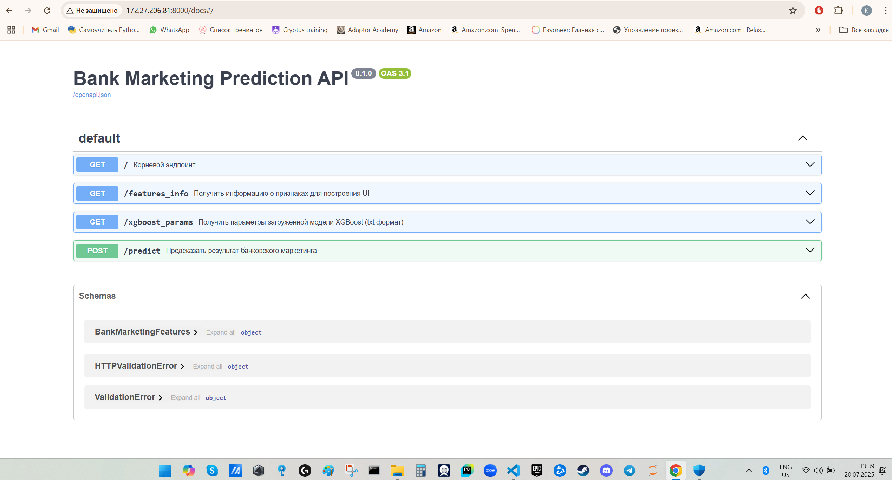

# Bank Marketing Campaign Prediction API

Небольшой проект для предсказания результата банковской маркетинговой кампании.

## 📋 Описание

В проекте используется модель XGBoost и API на FastAPI.
Можно отправить данные клиента и получить предсказание через HTTP запрос.

## 🚀 Особенности

- Модель XGBoost
- API на FastAPI
- Используются 10 признаков
- Есть авто-кодирование категориальных полей
- Есть Swagger документация

## 📁 Структура проекта

```
Bank-Marketing-Campaign/
├── app/
│   ├── main.py              # FastAPI приложение
│   ├── endpoint.py          # Определение моделей данных Pydantic
│   ├── model.py             # Логика работы с моделью
│   └── __pycache__/
├── data/
│   └── bank_full.csv        # Тренировочные данные
├── bank_marketing.ipynb     # Ноутбук с анализом и обучением
├── models/
│   ├── all_bank_marketing_artifacts.joblib
│   └── xgboost_params.txt
├── README.md                # Этот файл
├── requirements.txt         # Зависимости проекта
```

## 🛠️ Установка

### 1. Клонирование репозитория

```bash
git clone <repository-url>
cd Bank-Marketing-Campaign
```

### 2. Создание виртуального окружения

```bash
# Windows
python -m venv venv
venv\Scripts\Activate.ps1

# Linux/macOS
python3 -m venv venv
source venv/bin/activate
```

### 3. Установка зависимостей

```bash
pip install -r requirements.txt
```

## 📦 Зависимости

- numpy
- pandas
- scikit-learn
- xgboost
- fastapi
- uvicorn
- pydantic
- joblib
- matplotlib
- seaborn

## 🚀 Запуск

### Запуск API сервера

```bash
python app/main.py
```

или напрямую через uvicorn:

```bash
uvicorn app.main:app --reload
```

Сервер запустится на `http://localhost:8000`

### Доступ к документации

- **Swagger UI**: http://localhost:8000/docs
- **ReDoc**: http://localhost:8000/redoc

## 📊 Используемые признаки

Модель использует 10 признаков:

| Признак | Тип | Описание |
|---------|-----|---------|
| `poutcome` | str | Результат предыдущей кампании |
| `contact` | str | Тип контакта |
| `duration` | int | Продолжительность контакта (сек) |
| `housing` | str | Есть ли ипотека |
| `month` | str | Месяц контакта |
| `previous` | int | Количество предыдущих контактов |
| `pdays` | int | Дней с последнего контакта |
| `loan` | str | Есть ли личный кредит |
| `age` | int | Возраст клиента |
| `day` | int | День месяца |

## 🔮 Пример использования API

### Запрос

```bash
curl -X POST "http://localhost:8000/predict" \
  -H "Content-Type: application/json" \
  -d {
    "poutcome": "success",
    "contact": "cellular",
    "duration": 600,
    "housing": "yes",
    "month": "may",
    "previous": 1,
    "pdays": 100,
    "loan": "no",
    "age": 45,
    "day": 15
  }
```

### Ответ

```json
{
  "prediction_raw": 1,
  "prediction_text": "yes",
  "probability_class_0": 0.15,
  "probability_class_1": 0.85
}
```
### Пример интерфейса



## 📝 Обучение модели

Полный процесс подготовки данных и обучения есть в ноутбуке [bank_marketing.ipynb](bank_marketing.ipynb).

В ноутбуке содержится:
- Исследовательский анализ данных (EDA)
- Предварительная обработка данных
- Обучение модели XGBoost
- Оценка производительности
- Визуализация результатов

## 📈 Метрики производительности

Модель оценивается по следующим метрикам:
- Accuracy (Точность)
- Precision (Точность предсказаний)
- Recall (Полнота)
- F1-Score
- ROC-AUC

## 🔧 Конфигурация

Параметры XGBoost сохраняются в файл `models/xgboost_params.txt`.

## 📊 Результаты модели

### Метрики производительности

 


### Важность признаков


## 📄 Лицензия

Учебный проект.

## 👨‍💻 Автор

Сделано в рамках практики по машинному обучению.

## 📞 Вопросы и предложения

Если есть идеи или ошибки, можно создать Issue в репозитории.
